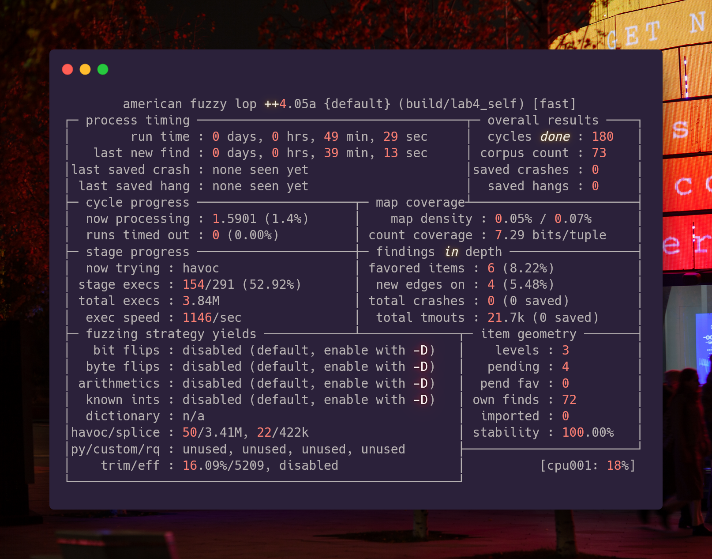

# Fuzzing task

The additional task here was to use fuzzing to check for memory and logical bugs in the written software.

I decided to use AFLplusplus as a compiler and fuzzer. It provides comfort interface to do such things.

I've written a small bash script that builds AFLplusplus and uses it against(sic!) implemented application.

## How to run that stuff

```bash
chmod +x build.bash
./build.bash

AFLplusplus/afl-fuzz -i in -o out_r build/lab4_readline
AFLplusplus/afl-fuzz -i in -o out_s build/lab4_self
```

**Run fuzzing separately!** Fuzzing takes whole terminal windows as soon as it is run as a ncurses application.

## How fuzzing process looks like



## Troubleshooting

If you expierence troubles in installing AFL++, refer to AFLplusplus' installation docs: **[docs/INSTALL.md](https://github.com/AFLplusplus/AFLplusplus/blob/stable/docs/INSTALL.md)**
